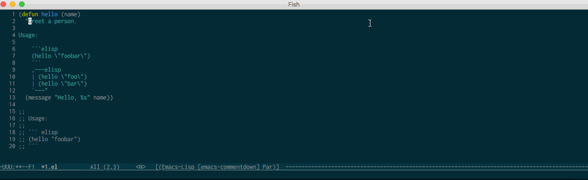
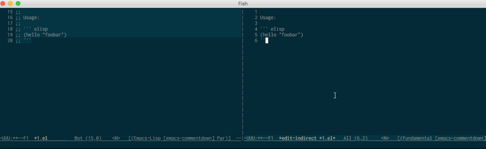

[](https://travis-ci.com/twlz0ne/comment-edit.el)

# comment-edit.el

Edit comment or docstring or code blocks inside them in separate buffers.

## Installation

Clone this repository to `~/.emacs.d/site-lisp/comment-edit`. Add the following to your `.emacs`:

```elisp
(require 'comment-edit)
(define-key prog-mode-map (kbd "C-c '") #'comment-edit)
```

## Usage

- Move the cursor to a comment or docstring, or a code block in them.
- <kbd>C-c '</kbd>

## Screencasts

<p float="left" align="center">
  
  
</p>

<i>P.S.</i> The language identifier of code block can be omitted in these cases.
